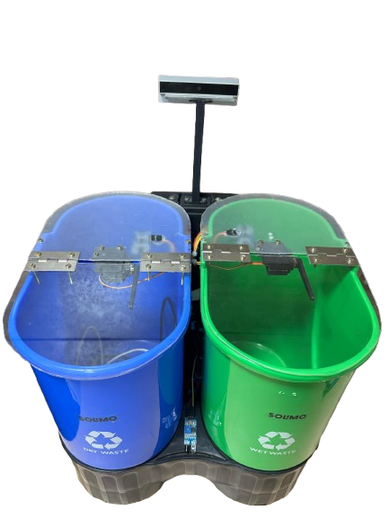

# Mini SmartBin



A **Mini SmartBin** powered by **Raspberry Pi** and **CNN-based image processing** to classify waste as **degradable** or **non-degradable**, and automatically open the corresponding lid using **servo motors**. The system also monitors bin fill levels using **ultrasonic sensors** and pushes data remotely via API.

---

## Features

- **CNN Image Classification** for detecting degradable/non-degradable waste.
- **IR Sensor Trigger** to detect motion and initiate processing.
- **Servo Control** to open appropriate bin lid based on classification.
- **Ultrasonic Sensors** to measure fill levels of each bin.
- **Remote API Integration** to send bin status and fill level.
- **Automated Sequence** from detection to data push and reset.

---

## System Workflow

1. **Motion Detection** using IR sensor.
2. **Image Capture** of the incoming waste.
3. **Image Processing** using a trained CNN model.
4. **Waste Classification** into:
   - _Degradable_ → Open degradable bin.
   - _Non-Degradable_ → Open non-degradable bin.
5. **Ultrasonic Sensors** measure fill level in both bins.
6. **Data Push** to remote server via API.
7. **Lid Closes**, and system returns to waiting state.

---

## Tech Stack

- **Raspberry Pi** (Main Controller)
- **Python** (for image processing, hardware control, API)
- **TensorFlow/Keras** (CNN model)
- **OpenCV** (Image handling)
- **Servo Motors**
- **Ultrasonic Sensors (HC-SR04)**
- **IR Sensor**

---

## Project Structure

```
mini_smartbin/

├── deployment
│   ├── bin_open.py
│   ├── captured_image.jpg
│   ├── fill_measure.py
│   ├── fill_percent_data.json
│   ├── image_capture.py
│   ├── image_process.py
│   ├── main.py
│   ├── post_sensor_data.py
│   ├── requirements.txt
│   └── utils.py
├── img_processing
│   ├── data
│   │   ├── README.md
│   │   ├── test
│   │   └── train
│   └── weights
│       └── model.h5
├── README.md
└── startup_script.sh
```

---

## Visual Overview

The system waits until motion is detected. It then performs the following actions:

1. Captures waste image
2. Processes it using CNN
3. Opens the appropriate bin
4. Measures fill level
5. Sends data to remote API
6. Closes the bin and waits for next input

---
